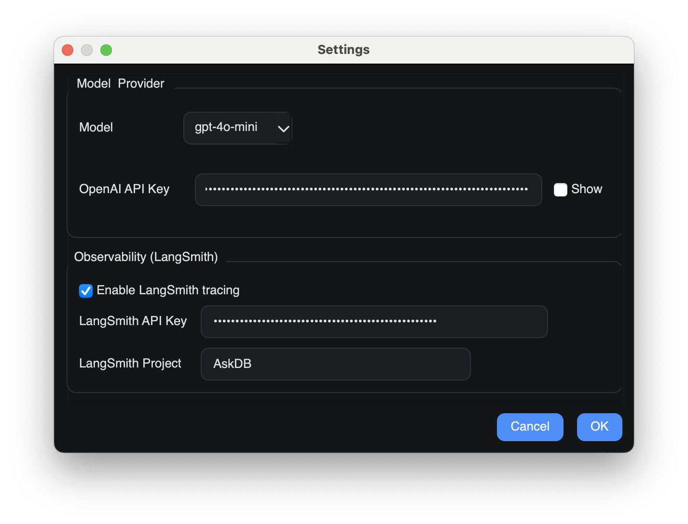

# AskDB — Ask your database anything

> Natural language to SQL desktop app for PostgreSQL, MySQL, and SQLite.

[⬇️ Download (Releases)](https://github.com/DreamyPhobic/AskDB/releases) · [⭐ Star on GitHub](https://github.com/DreamyPhobic/AskDB) · [Readme](https://github.com/DreamyPhobic/AskDB#readme)

## Demo video

## Features

- Natural language → SQL using OpenAI via LangChain
- Clean desktop UI (PySide6/Qt): chat, generated SQL, and results in one place
- Streaming responses with captured intermediate SQL steps
- “Queries Executed” list: click to run again; right‑click to copy SQL
- Custom SQL editor with Run button
- Results table with auto column sizing
- Connection management:
  - Paste full database URL or fill fields manually
  - Auto‑detect DB type (postgres/mysql/sqlite) from URL
  - Auto‑populate host/port/database/user/password from URL
  - Test connectivity, Save for reuse, Recent connections, Reconnect
- Settings: set `OPENAI_API_KEY`, choose model (default `gpt-4o-mini`), optional LangSmith tracing
- macOS packaging via PyInstaller (`.app` and optional `.dmg`)

## Screenshots

## How it works

1. You ask a question in plain English
2. The AI generates SQL with LangChain + OpenAI
3. SQL is executed via SQLAlchemy against your database
4. Results appear instantly in the UI

Supported databases: PostgreSQL (`psycopg2`), MySQL (`pymysql`), SQLite

## FAQ

- Does my data leave my machine?
  - Queries run locally against your DB. Prompt text goes to your configured LLM provider (OpenAI). Enable LangSmith only if you want tracing.
- Can I use manual SQL?
  - Yes. Use the Custom Query editor and click Run.
- macOS only?
  - Packaged app targets macOS. You can run from source anywhere Python 3.10+ is available.

## Get involved

- Issues and feature requests: open an issue on GitHub
- Contributions welcome: fork and PR

Built with PySide6, SQLAlchemy, LangChain, and OpenAI.

